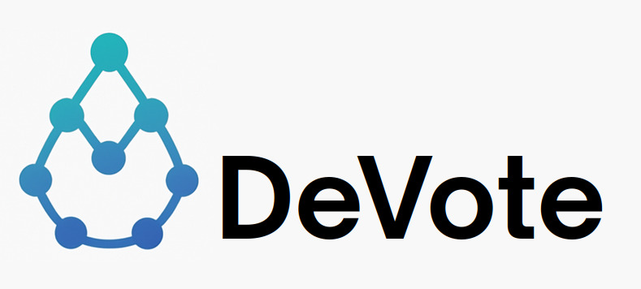

<div align="center">
  
</div>

> A full-stack, privacy-preserving **hackathon voting** dApp on **Sui** with **zkLogin** onboarding, **one-person-one-vote** via nullifiers, team self-vote prevention, and an auditable yet privacy-respecting results flow.

---

##  TL;DR

- **Idea:** Simple, fair, privacy-preserving voting for hackathons/contests. Users log in with OAuth (Google/Apple/etc.) via **zkLogin**—no seed phrases.
- **Goal:** Guarantee **one human → one vote**, prevent **self-voting**, and keep choices private while keeping tallies verifiable on-chain.
- **What's on-chain:** Team registry, project ↔ team mapping, nullifier checklists, vote tallies, events, and lifecycle controls (open → closed → finalized).
- **What's off-chain:** OAuth, issuance of zk proofs, optional allowlists, and the ephemeral key & salt handling needed by zkLogin.
- **Frontend:** Next.js/React (Sui dapp-kit), flows for login, registration, casting vote, admin ops, and result views.
- **Security:** Nullifiers to stop double-voting, project–team link prevents self-votes, admin caps and pausability, audit events.

### 📦 Deployed Package IDs (Devnet)

- Voting Package: `0xa9904399c92edf750a34f7a7018c67e356270a09cfb86c91243afb3f18544e88`
- Voting Registry: `0x42599a46877871145418c5106d5acbf2e1f573768bdc1c9304d6030e9f271cd9`
- Poll Registry: `0x1cb2788134f00fa5c6f921dd0dfebc95942409d16963152abd4b7097d71082b8`

---

## 1) The Big Picture

### 1.1 Problem
Hackathon voting should be inclusive (no wallet friction), fair (no duplicates/ballot stuffing), and private (don’t deanonymize voters). Classic web2 forms are spoofable; classic crypto wallets are UX-heavy.

### 1.2 Our Approach
- **zkLogin**: users authenticate with familiar OAuth; we still get a **verifiable Sui address** and a **zero-knowledge link** so the OAuth identity **isn’t** revealed on-chain.
- **Nullifiers**: each human produces a **unique nullifier** (per contest) that’s unusable twice → **one vote** only.
- **Self-vote prevention**: mapping of **projectId → teamId** ensures team members can’t vote for their own project.
- **On-chain tallies**: public integrity with private identities.

---

## 2) Objectives & Non-Objectives

### 2.1 Objectives
- One-person-one-vote with cryptographic enforcement.
- Gas-efficient storage for hundreds/thousands of voters.
- Easy onboarding (**no seed phrases**).
- Clear, reversible admin lifecycle (open/close/finalize).
- Auditable events for transparency.

### 2.2 Non-Objectives
- Not designed for national elections.
- Not a general identity platform (relies on zkLogin for that).
- Not a DAO governance token system (no token-weighted votes).

---

## 3) Use Cases / Applications

- **Hackathons**: public demo day voting, juried tracks, people’s choice.
- **Accelerators & Incubators**: cohort showcase voting.
- **University project fairs**: fair + quick selection.
- **Internal product reviews**: anonymous employee voting.

---

## 4) System Architecture

```
┌────────────────────────┐
│     Browser Frontend   │
│  React + Sui dapp-kit  │
│  zkLogin (OAuth flow)  │
└─────────▲───┬──────────┘
          │   │
          │   │ OAuth (IdP)
          │   ▼
┌─────────┴────────┐      ┌─────────────────────┐
│ zkLogin Helpers  │      │ OAuth Provider (IdP)│
│ (ephemeral key,  │<---->│ Google / Apple / …  │
│ nonce, salt, ZK  │      └─────────────────────┘
│ proof assembly)  │
└─────────▲────────┘
          │ ZK proof + signature
          ▼
┌────────────────────────┐
│   Sui Blockchain       │
│ Move module:           │
│  - Registry (singleton)│
│  - Tables:             │
│     member→team        │
│     project→team       │
│     team→voteCount     │
│     used_nullifiers    │
│  - Admin cap / control │
│  - Events              │
└────────────────────────┘
```

---

## 5) On-Chain Data Model (Move)

**Core object:** `Registry` (shared)
- `paused: bool`
- `member_to_team: Table<NullifierHash, TeamId>`
- `project_to_team: Table<ProjectId, TeamId>`
- `team_vote_count: Table<TeamId, u64>`
- `used_nullifiers: Table<NullifierHash, bool>`
- `is_open: bool`
- `is_finalized: bool`

**Aliases**
- `type TeamId = u64`
- `type ProjectId = ID`
- `type NullifierHash = vector<u8>`

**Events**
- `TeamRegistered { team_id, project_id, name }`
- `MemberLinked { nullifier, team_id }`
- `VoteCast { voter_nullifier, team_id, project_id, ts }`
- `Closed {}`
- `Finalized {}`
- `Paused {}` / `Unpaused {}`

---

## 6) Voting Algorithm (High Level)

1. **Registration (Admin)**
   - Register `team_id` and bind `project_id → team_id`.
   - Optional human-readable metadata in event.

2. **Member Linking (Optional)**
   - Organizer links member nullifier to a team (e.g., pre-checkin), or this can be self-service via proof of affiliation (off-chain) leading to an organizer call.

3. **Open Voting**
   - `is_open = true`, `is_finalized = false`, contract unpaused.

4. **Cast Vote**
   - Input: `nullifier_hash`, `project_id`.
   - Checks:
     - Contest **open** & not **finalized**.
     - `nullifier_hash` **not in** `used_nullifiers`.
     - Resolve `project_id → team_id`.
     - If `member_to_team[nullifier]` exists, ensure **not voting own team**.
   - Effects:
     - `used_nullifiers[nullifier] = true`.
     - `team_vote_count[team_id] += 1`.
     - Emit `VoteCast` event.

5. **Close / Finalize**
   - `close()` stops new votes.
   - `finalize()` freezes tallies for publishing/prizes.

6. **Query**
   - Anyone can read `team_vote_count[team_id]` (public tally).
   - Privacy preserved: identities never revealed, only nullifier usage.

**Why it enforces 1PV (one person vote):**
- Each OAuth identity → deterministic nullifier (per contest salt/scope).
- A used nullifier cannot be reused (on-chain check).

**Why it prevents self-vote:**
- If a nullifier is mapped to a `team_id`, the vote **must** target a different team than `member_to_team[nullifier]`.

---

## 7) Threat Model & Security Notes

- **Double voting:** blocked by `used_nullifiers`.
- **Sybil (multiple OAuth accounts):** mitigated by event rules (e.g., physical check-in → link nullifier to attendee list). For public web voting, use **email domain allowlists** or **ticket scans** off-chain to minimize abuse.
- **Admin abuse:** separate `AdminCap` controls lifecycle. Store admin’s `ID` and gate sensitive functions.
- **Proof freshness:** zkLogin proof carries **maxEpoch**; expired proofs are invalid.
- **Salt custody:** Keep salt server-side (never with IdP) to enforce 2-factor.
- **DoS on tables:** bound table growth (e.g., max teams) and use `paused` to mitigate incidents.

---

## 8) Frontend UX Flow

1. **Landing:** list teams/projects + “Login to Vote”.
2. **Login:** zkLogin OAuth flow → gets Sui address & proof.
3. **Eligibility check (optional):** backend validates user domain/allowlist; if valid, app proceeds.
4. **Vote Screen:** pick a project → we resolve to team → call `cast_vote(nullifier, project_id)` with zkLogin signature.
5. **Receipt:** show on-chain tx digest + updated leaderboard.
6. **Admin Dashboard:** register teams, open/close/finalize, pause/unpause, export events.

---

## 9) On-Chain Packages

The DeVote project includes several on-chain packages developed in Move for the Sui blockchain:

### 9.1 Main Package: `voting_contract`

**Location:** `/voting_contract/`
**Module name:** `voting::voting`
**Description:** Main package containing all privacy-preserving voting logic.

**Key Components:**
- **Registry**: Main shared object storing contest state
- **AdminCap**: Admin capability to control voting lifecycle
- **RegistrarCap**: Registration capability to manage teams and projects
- **FinalizerCap**: Finalizer capability to seal results

**Data Tables:**
- `member_to_team`: Mapping nullifier → team ID
- `project_to_team`: Mapping project ID → team ID  
- `team_vote_count`: Vote counters per team
- `used_nullifiers`: Used nullifiers (double-vote prevention)
- `groups`: Support for voter groups (optional)

**Main Functions:**
- `register_team()`: Register a team/project
- `link_member()`: Link member ↔ team
- `cast_vote()`: Vote with nullifier verification
- `open()` / `close()` / `finalize()`: Lifecycle control
- `pause()` / `unpause()`: Emergency controls

**Emitted Events:**
- `TeamRegistered`: New team registered
- `MemberLinked`: Member linked to team
- `VoteCast`: Vote cast
- `Closed` / `Finalized`: Contest states
- `Paused` / `Unpaused`: Emergency controls

### 9.2 Demo Package: `counter`

**Location:** `/move/counter/`
**Module name:** `counter::counter`
**Description:** Simple shared object example for demonstration and testing.

**Components:**
- **Counter**: Shared object with incrementable counter
- **OwnerCap**: Owner capability (unused in current implementation)

**Functions:**
- `create()`: Create a new shared counter
- `increment()`: Increment counter (+1)
- `set_value()`: Set value (owner only)

### 9.3 Package Configuration

**Sui Framework Dependencies:**
- Version: `framework/testnet` (for counter)
- Move Edition: `2024.beta`

**Named Addresses:**
- `voting = "0x0"` (voting_contract package)
- `counter = "0x0"` (counter package)

### 9.4 Build and Deploy

```bash
# Main voting package
cd voting_contract
sui move build
sui client publish --gas-budget 100000000

# Demo package (optional)
cd move/counter  
sui move build
sui client publish --gas-budget 50000000
```

**Note:** The `counter` package is primarily used for demonstration and testing purposes. The functional core of DeVote resides in the `voting_contract` package.

---

## 10) Repository Structure

```
.
├── move/
│   └── counter/
│       ├── Move.toml
│       └── sources/
│           └── counter.move
├── voting_contract/
│   ├── Move.toml
│   └── sources/
│       ├── voting.move
│       └── voting_contract.move
├── frontend/
│   ├── app/ (Next.js App Router)
│   │   ├── page.tsx
│   │   ├── providers.tsx
│   │   ├── layout.tsx
│   │   ├── globals.css
│   │   └── components/
│   │       ├── Navbar.tsx
│   │       ├── TeamCard.tsx
│   │       ├── VotePanel.tsx
│   │       └── AdminPanel.tsx
│   ├── lib/
│   │   ├── zklogin.ts  (nonce, randomness, seed, signature helpers)
│   │   └── sui.ts      (client, tx helpers)
│   ├── env.example
│   └── package.json
└── README.md
```

---

## 11) Smart Contract (Move) – Key Entry Points

> **Note:** Names mirror your latest snippets. If your local version differs, adjust identifiers accordingly.

- `public entry fun register_team(...)`
- `public entry fun link_member(...)`
- `public entry fun cast_vote(...)`
- `public entry fun open(...)`
- `public entry fun close(...)`
- `public entry fun finalize(...)`
- `public entry fun pause(...)`
- `public entry fun unpause(...)`

**Init**
- `fun init(ctx: &mut TxContext)` must be **internal** to its module; it creates `Registry` and an `AdminCap`, then `transfer::share_object(reg)` and `transfer::transfer(admin_cap, tx_context::sender(ctx))`.

---

## 12) zkLogin: What You Need to Know (Short)

- **OAuth login** → you get an `id_token` (JWT).
- Browser creates **ephemeral keypair** and **address seed**:
  - `nonce = generateNonce(...)`
  - `addressSeed = genAddressSeed(jwt, salt, randomness)`
  - `ephemeralPublicKey = getExtendedEphemeralPublicKey(...)`
- Get proof bundle from zkLogin service (MPC/prover; depends on your setup).
- Final signature:  
  `const sig = getZkLoginSignature({ inputs: { ...zkProofs, addressSeed }, maxEpoch, userSignature })`
- Submit tx with `sig` as the **SerializedSignature**.

---

## 13) Environment Variables

Create `frontend/.env.local` from `env.example`:

```
# --- REQUIRED ---
NEXT_PUBLIC_SUI_NETWORK=testnet  # or mainnet/localnet
NEXT_PUBLIC_PACKAGE_ID=<YOUR_PACKAGE_ID>
NEXT_PUBLIC_REGISTRY_ID=<YOUR_REGISTRY_OBJECT_ID>
NEXT_PUBLIC_ZK_OAUTH_PROVIDER=<google|apple|facebook>
NEXT_PUBLIC_ZK_CLIENT_ID=<YOUR_OAUTH_CLIENT_ID>

# --- BACKEND (optional) ---
BACKEND_BASE_URL=http://localhost:4000

# --- SECURITY ---
# Keep the salt on the server; do NOT expose in browser .env
ZK_SALT_HEX=<SERVER_SIDE_32B_HEX>
```

> **Never** expose the **salt** to the browser. Keep it server-side.

---

## 14) Setup & Commands

### 14.1 Prerequisites
- Node 18+
- pnpm or yarn
- Sui CLI (for dev/test)
- Move toolchain

### 14.2 Move: Build & Publish
```bash
# Main voting package
cd voting_contract
sui move build
sui client publish --gas-budget 100000000
# Note the package ID and shared Registry object ID

# Demo package (optional)
cd move/counter
sui move build
sui client publish --gas-budget 50000000
```

### 14.3 Frontend: Run
```bash
cd frontend
pnpm i
pnpm dev
```

---

## 15) Frontend Integration Highlights

- **Creating a Move vector in TS SDK**  
  The Sui SDK expects **Move vectors**, not raw JS arrays, for certain args. Use helper:
  ```ts
  import { TransactionBlock } from '@mysten/sui.js/transactions';

  const tx = new TransactionBlock();
  // Example: passing a vector<u8> for NullifierHash
  const nullifierBytes = Array.from(Uint8Array.from(Buffer.from(nullifierHex, 'hex')));
  const mv = tx.makeMoveVec({ elements: nullifierBytes.map(b => tx.pure.u8(b)) }); // vector<u8>
  tx.moveCall({
    target: `${packageId}::voting::cast_vote`,
    arguments: [ tx.object(registryId), mv, tx.pure(projectId), tx.object('0x6') /* clock */ ],
  });
  ```
  If you see `Invalid type: Expected Object but received Array`, it’s because the SDK wants the **vector object** produced by `makeMoveVec`, not a JS array.

- **Signing with zkLogin**
  ```ts
  const zkSig: SerializedSignature = getZkLoginSignature({
    inputs: { ...zkProofs, addressSeed },
    maxEpoch,
    userSignature, // signature with ephemeral private key over the tx bytes
  });

  const res = await client.executeTransactionBlock({
    transactionBlock: await tx.build({ client }),
    signature: zkSig,
    options: { showEffects: true, showEvents: true },
  });
  ```

---

## 16) Admin Lifecycle

- **Register team:** add `(team_id, project_id)` pairing.
- **Open:** start accepting votes.
- **Pause:** temporary emergency stop (still not finalized).
- **Close:** stop accepting votes (pre-finalization).
- **Finalize:** seal tallies; after this, no further changes.

**Good practice**
- Emit an `Announcement` event on each transition.
- Frontend should read the current state and disable UI actions accordingly.

---

## 17) Data Access & Analytics

- **On-chain tables:** read `team_vote_count[team_id]`.
- **Events to index:** `TeamRegistered`, `VoteCast`, `Closed`, `Finalized`.
- **Leaderboards:** either query live via Sui RPC or mirror in a lightweight DB for dashboards.

---

## 18) Testing Strategy

- **Move unit tests:** invariants (no double votes, self-vote blocked, lifecycle constraints).
- **Localnet e2e:** spin localnet, publish module, run scripted votes.
- **Frontend cypress tests:** login mocks, casting, state gating.
- **Property tests:** fuzz different sequences (pause/unpause/close/finalize edge cases).

---

## 19) Gas & Scalability

- **Tables** keep per-team counters small; events carry detail without bloating state.
- **Nullifier check** is O(1) on table lookup.
- Large cohorts: paginate event scans; pre-load `project→team` map client-side.

---

## 20) Limitations & Future Work

- **Sybil resistance** depends on off-chain policy (allowlists, domain, ticketing).
- **Selective disclosure** (e.g., proving eligibility without deanonymization) can be extended with additional ZK circuits.
- **Delegated voting** / ranked-choice support can be added with new entry points.

**Roadmap**
- Ranked Choice / Score Voting modes.
- Per-track voting (multiple nullifier namespaces).
- On-chain metadata registry (names, logos).
- Export results as signed JSON with Merkle root for audit.

---

## 21) Roles & Permissions

- **AdminCap holder**: can register teams, open/close/finalize, pause/unpause.
- **Voter**: any zkLogin user who passes off-chain eligibility and has a valid nullifier.
- **Auditor**: reads tallies and events; no special on-chain permission needed.

---

## 22) API Notes (Optional Backend)

If you run a tiny backend for allowlists / nonces:

- `POST /auth/nonce` → returns server nonce for zkLogin
- `POST /auth/verify` → verifies `id_token` & domain policy
- `POST /zk/proof` → returns zk proof bundle (if you proxy a prover)
- Never return the **salt** to the client.

---

## 23) Operational Runbook

- **Before event**: publish module, record `packageId` + `registryId`, configure OAuth creds, preload teams, run **open**.
- **During event**: monitor RPC, track `VoteCast` rate, keep an eye on pauses if needed.
- **After event**: **close** → **finalize**, export tally & event log, post winners.

---

## 24) Glossary

- **Nullifier**: unique, non-reusable tag derived from identity + scope (prevents double voting).
- **zkLogin**: Sui native scheme to derive addresses & signatures from OAuth while preserving privacy.
- **Registry**: shared on-chain object that stores the contest’s state and tables.

---


